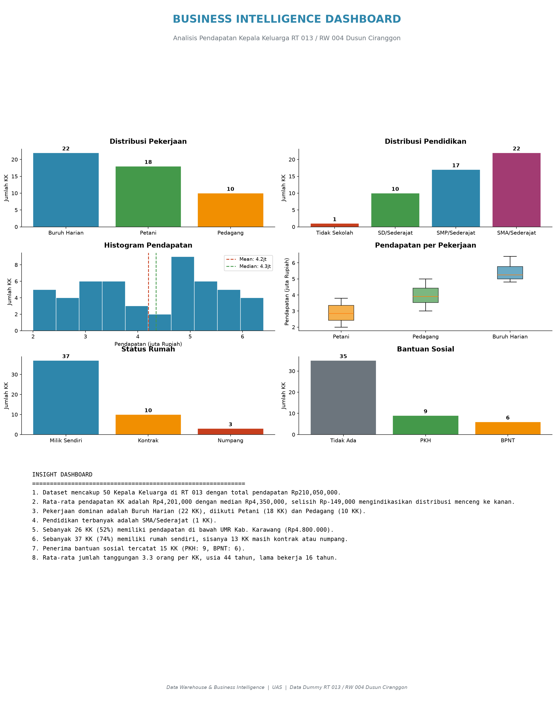

# Analisis Pendapatan Kepala Keluarga
## RT 013 / RW 004 Dusun Ciranggon, Desa Ciranggon, Kecamatan Majalaya, Kabupaten Karawang

---

## 🌐 Demo Online

Dashboard Streamlit:  
[https://dwh-income-analysis.streamlit.app/](https://dwh-income-analysis.streamlit.app/)

Source Code:  
[https://github.com/kanghendar27/data-warehouse-income-analysis](https://github.com/kanghendar27/data-warehouse-income-analysis)

---

## Dashboard Preview



---

## Latar Belakang

Pemahaman terhadap profil pendapatan kepala keluarga (KK) di tingkat mikro sangat penting untuk perencanaan pembangunan dan kebijakan sosial yang tepat sasaran. Wilayah RT 013 / RW 004 Dusun Ciranggon merupakan salah satu unit komunitas terkecil yang datanya jarang terdokumentasi secara terstruktur. Proyek ini menggunakan **data dummy** yang dirancang menyerupai kondisi riil untuk tujuan pembelajaran membangun data warehouse dan melakukan analisis Business Intelligence guna menggali pola pendapatan KK di lingkungan tersebut.

## Tujuan

- Membangun data warehouse sederhana yang mengintegrasikan data demografis dan pendapatan KK.
- Menyediakan dashboard visual yang memperlihatkan distribusi pendapatan, kategori pekerjaan, serta tingkat kesejahteraan.
- Menjawab pertanyaan-pertanyaan bisnis terkait profil ekonomi warga RT 013 / RW 004.
- Menyusun rekomendasi berbasis data untuk intervensi program pemberdayaan ekonomi.

## Business Problem

Pemerintah desa Ciranggon dan pihak terkait belum memiliki pangkalan data terpadu yang dapat digunakan untuk memahami kondisi ekonomi kepala keluarga di tingkat RT. Akibatnya, program bantuan dan pemberdayaan seringkali tidak tepat sasaran. Diperlukan sebuah sistem data warehouse dan analisis BI untuk menyajikan informasi pendapatan KK secara akurat, ringkas, dan dapat diakses.

## Business Questions

1. Berapa rata-rata pendapatan kepala keluarga per bulan di RT 013 / RW 004?
2. Bagaimana distribusi pendapatan berdasarkan kelompok usia kepala keluarga?
3. Apa sektor pekerjaan yang paling dominan di wilayah ini?
4. Berapa jumlah Kepala Keluarga yang memiliki pendapatan di bawah UMR Kabupaten Karawang?
5. Bagaimana korelasi antara tingkat pendidikan dan pendapatan KK?
6. Berapa jumlah tanggungan rata-rata per KK dan bagaimana pengaruhnya terhadap pendapatan per kapita?
7. Kategori pendapatan mana (rendah/sedang/tinggi) yang paling banyak jumlah KK-nya?
8. Apakah terdapat perbedaan pendapatan signifikan antara KK dengan status rumah milik sendiri vs kontrak?

## Project Scope

**In Scope:**
- Analisis pendapatan Kepala Keluarga
- ETL menggunakan Pandas
- Data Warehouse sederhana (Star Schema)
- Dashboard Business Intelligence
- Insight dan rekomendasi

**Out of Scope:**
- Machine Learning
- Prediksi pendapatan
- Web Dashboard
- Big Data
- Data resmi pemerintah

## Desain Data Warehouse

Proyek ini menggunakan **Star Schema** sederhana dengan satu fact table dan lima dimension table.

**Fact Table:**
- `Fact_Pendapatan` — Menyimpan data pendapatan bulanan setiap Kepala Keluarga beserta foreign key ke seluruh dimensi.

**Dimension Table:**
- `Dim_Warga` — Data demografis Kepala Keluarga (nama, umur, jenis kelamin, jumlah tanggungan, status rumah, kendaraan, bantuan sosial).
- `Dim_Pekerjaan` — Data sektor pekerjaan dan lama bekerja.
- `Dim_Pendidikan` — Data tingkat pendidikan terakhir.
- `Dim_Waktu` — Data periode (bulan, tahun) pencatatan pendapatan.
- `Dim_Wilayah` — Data hierarki wilayah (RT, RW, Dusun, Desa, Kecamatan, Kabupaten).

## KPI yang Dianalisis

| KPI | Deskripsi |
|-----|-----------|
| Rata-rata Pendapatan KK | Mean pendapatan per bulan seluruh KK |
| Median Pendapatan KK | Median pendapatan untuk mengukur tendensi sentral yang robust terhadap outlier |
| Persentase KK di Bawah UMR | Proporsi KK dengan pendapatan di bawah UMR Kab. Karawang |
| Distribusi Sektor Pekerjaan | Proporsi KK per sektor pekerjaan utama |
| Rata-rata Jumlah Tanggungan | Mean anggota keluarga per KK |

## Cara Menjalankan Secara Lokal

### Clone Repository

```bash
git clone https://github.com/kanghendar27/data-warehouse-income-analysis.git
cd data-warehouse-income-analysis
```

### Buat Virtual Environment

```bash
python -m venv .venv
```

**Windows:**

```bash
.venv\Scripts\activate
```

**Linux / Mac:**

```bash
source .venv/bin/activate
```

### Install Dependency

**Notebook:**

```bash
pip install -r requirements.txt
```

**Streamlit:**

```bash
pip install -r requirements_streamlit.txt
```

### Jalankan Notebook

Urutan:

1. `01_ETL.ipynb`
2. `02_Exploratory_Data_Analysis.ipynb`
3. `03_Business_Intelligence_Dashboard.ipynb`
4. `04_Final_Report.ipynb`

### Jalankan Dashboard

```bash
streamlit run app.py
```

## Struktur Project

```
data-warehouse-income-analysis/
├── app.py                     # Aplikasi Streamlit dashboard
├── requirements.txt           # Dependency notebook
├── requirements_streamlit.txt # Dependency Streamlit
├── .gitignore
├── README.md
├── data/
│   ├── pendapatan_rt013.csv          # Dataset mentah
│   └── pendapatan_rt013_clean.csv    # Dataset setelah ETL
├── notebooks/
│   ├── 01_ETL.ipynb                          # Ekstrak, Transformasi, Load
│   ├── 02_Exploratory_Data_Analysis.ipynb    # Eksplorasi data
│   ├── 03_Business_Intelligence_Dashboard.ipynb  # Dashboard BI
│   └── 04_Final_Report.ipynb                 # Laporan akhir
├── charts/
│   ├── dashboard_bi.png              # Dashboard utama
│   ├── distribusi_pekerjaan.png      # Bar chart pekerjaan
│   ├── distribusi_pendidikan.png     # Bar chart pendidikan
│   ├── histogram_pendapatan.png      # Histogram pendapatan
│   └── pendapatan_per_pekerjaan.png  # Boxplot pendapatan
├── docs/
│   ├── DATA_DICTIONARY.md            # Kamus data
│   └── STAR_SCHEMA.md                # Desain Star Schema
└── src/                              # (placeholder)
```

## Teknologi yang Digunakan

- **Python** — Bahasa pemrograman utama
- **Pandas** — Manipulasi dan ETL data
- **Matplotlib** — Visualisasi dan dashboard
- **OpenPyXL** — Export ke Excel
- **Jupyter Notebook** — Lingkungan pengembangan interaktif
- **Streamlit** — Deployment dashboard web

## Roadmap Pengerjaan

| Fase | Aktivitas |
|------|-----------|
| **Fase 1: Setup Project** | Setup struktur folder, environment, dan dokumentasi awal |
| **Fase 2: Business Requirement** | Menentukan business questions, KPI, dan ruang lingkup proyek |
| **Fase 3: Data Warehouse Design** | Merancang Star Schema (fact & dimension table) |
| **Fase 4: Dataset Dummy** | Membangun dataset dummy realistis (demografi + pendapatan) |
| **Fase 5: ETL** | ETL menggunakan Pandas, load ke SQLite, validasi data |
| **Fase 6: Business Intelligence Dashboard** | Membuat grafik KPI dan dashboard menggunakan Matplotlib |
| **Fase 7: Insight & Kesimpulan** | Menyusun insight dan rekomendasi berbasis data |

## Lisensi

Project ini dibuat untuk keperluan pembelajaran pada mata kuliah **Data Warehouse & Business Intelligence**.
